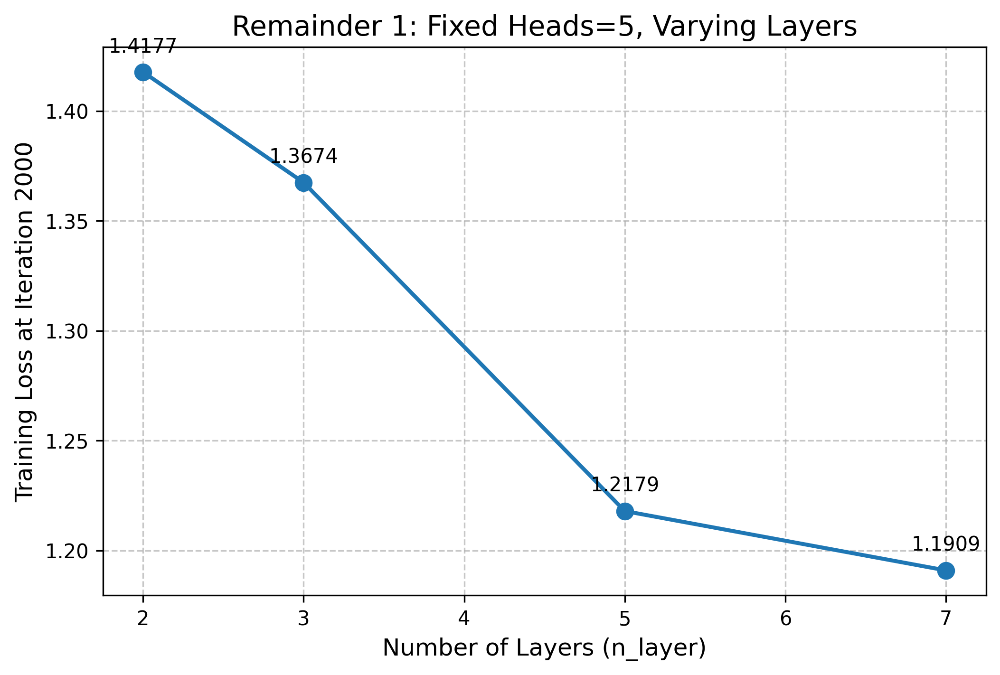

## Task 2  Shakespeare Generated Samples (first 5 lines)

KING RICHARD II:
Shall I be that set up your hands to my comfort?

DUKE OF YORK:
Then be petition enjoy'd my tents,
And I must be so too with me:

## Task 3 – Model Architecture Exploration

### Loss vs. Layers Plot

### Lowest Validation Loss Achieved
[1.4575]

### Best Model Settings
- Number of layers: [7]
- Number of heads: 5
- Embedding dimension: 320
- Max iterations: 2000

## Task 4  Code Generation Model

### Token Count
[379559]

### First 20 lines of generated code
eason = self.reason.decode("iso-8859-1")
        else:
            reason = self.reason

        if 400 <= self.status_code < 500:
            http_error_msg = (
                f"{self.status_code} Client Error: {reason} for url: {self.url}"
            )

        if http_error_msg:
            raise HTTPError(http_error_msg, response=self)

    def close(self) -> None:
        """Releases the connection back to the pool. Once this method has been
        called the underlying ``ra
---------------

        if self._thread_local.pos is not None:
            # Rewind the file position indicator of the body to where
            # it was to resend the request.
            if (seek := getattr(r.request.body, "seek", None)) is not None:
                seek(self._thread_local.pos)
        s_auth = r.headers.get("www-authenticate", "")

        if "digest" in s_auth.lower() and self._thread_local.num_401_calls < 2:
            self._thread_local.num_401_calls += 1

### Favorite generated snippet
self.hooks[event].remove(hook)
            return True
        except ValueError:
            return False
